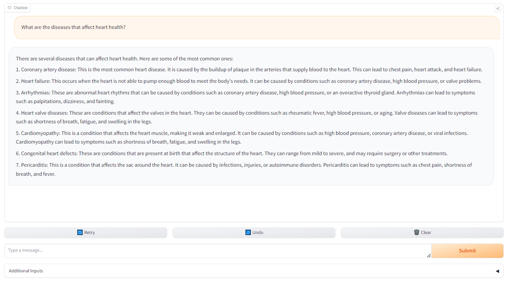

# BioMistral Medical Chatbot 🤖💉

A **medical chatbot** powered by the **BioMistral-7B-GGUF** model, designed to handle healthcare and biology-related queries using Hugging Face's open-source LLM. 
This chatbot helps simplify medical information retrieval in an interactive, conversational format.

## 🚀 Features
- **Medical Expertise**: Tailored for medical domains like biology, healthcare, and more.
- **Hugging Face Integration**: Seamlessly integrates with Hugging Face's powerful APIs.
- **Flexible Inference**: Supports multiple bit precisions for efficient model deployment.

## 🧬 Model
- **Model**: [BioMistral-7B-GGUF](https://huggingface.co/models/biomistral-7b-gguf)
- **Architecture**: LLaMA-based, 7.24B parameters.

## 🖼️ Chatbot Interface

## 📚 How to Use

Visit the [Hugging Face Space](https://huggingface.co/spaces/Anna2003/BioMistral-Medical-Chatbot) to interact with the chatbot.

---

Feel free to contribute and improve this project! 😊
